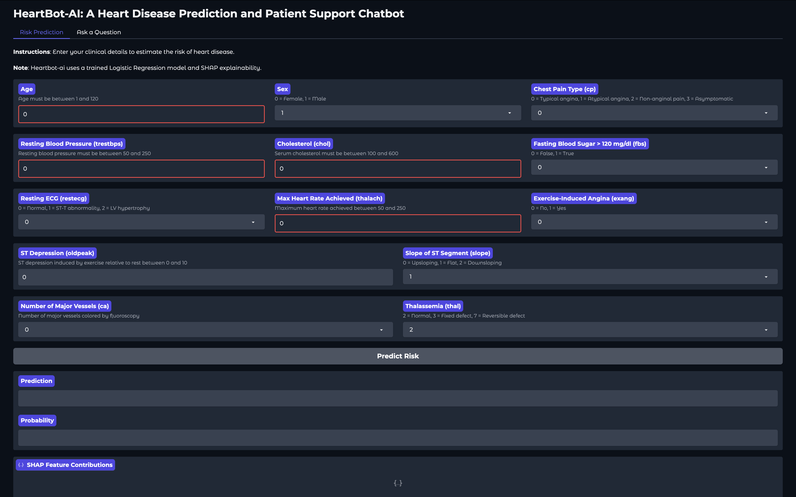
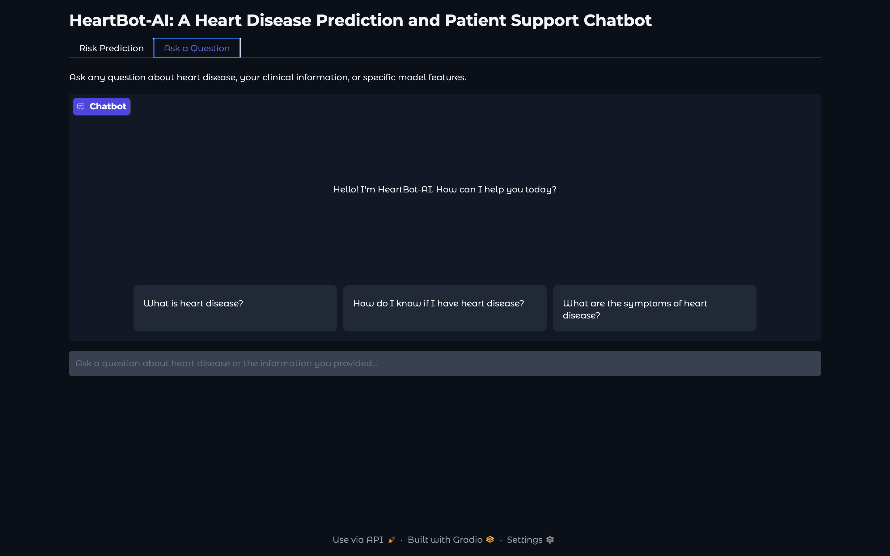

# **Heart Disease Prediction and Support Chatbot**
This project is decicated to MSAI-699 Capstone and aims to build an AI-powered heart disease prediction and patient support chatbot using Gradio, Hugging Face, and Groq. The goal is to provide a user friendly interface for users to input their data, gain knowledge about their data, recieve predictions about the presense of heart disease, and interact with a chatbot, heartbot-ai, that offers patient support and guidance for wellness.

# Table of Contents
1. [Screenshot](#screenshot)
2. [File Structure](#structure)
3. [Program Execution Flow](#file-execution-flow)
4. [Roadmap](#roadmap)


# Screenshot
### Prediction Interface


### Chat Interface


A prototype link to the app for live interaction can be found here: **[LIVE](http://derrickdk777-heartbot-ai.hf.space/)**

# Structure
```bash
project/
│
├── data/
│   └── docs/                # PDFs, dataset descriptions
│
├── dataset/
│   └── models/
│    │  └── heart_model.pkl      # Full pipeline model build         
│    ├── ...exploration.ipynb
│    ├── ...model_training.ipynb
│    └── ...optimization.ipynb
│
├── src/
│   ├── config.py            # API keys, constants, paths
│   ├── model_loader.py      # loads .pkl model + SHAP explainer
│   ├── predictor.py         # prediction + SHAP logic
│   ├── rag_pipeline.py      # embeddings, vector store, retrieval, Groq LLM, Local LLM fallback
│   ├── heartbot.py           # unified chatbot logic (prediction + RAG)
│   └── ui.py                # Gradio interface
│
├── app.py                   # main entry point
│
└── requirements.txt
```

# File Execution Flow
```bash
┌──────────────────────────────────────────────┐
│                 app.py                       │
│        (Entry point of the application)      │
└──────────────────────────────────────────────┘
                         │
                         ▼
        ┌────────────────────────────────┐
        │        build_interface()       │
        │        (from ui.py)            │
        └────────────────────────────────┘
                         │
                         ▼
        ┌────────────────────────────────┐
        │            HeartBot()          │
        │        (from heartbot.py)      │
        └────────────────────────────────┘
                         │
                         ▼
        ┌────────────────────────────────┐
        │       PredictionService()      │
        │        (from predictor.py)     │
        └────────────────────────────────┘
                         │
                         ▼
        ┌──────────────────────────────────────────────┐
        │                model_loader.py               │
        │  - load_model("heart_model.pkl")             │
        │  - init_shap_explainer(model)                │
        └──────────────────────────────────────────────┘
                         │
                         ▼
        ┌──────────────────────────────────────────────┐
        │                rag_pipeline.py               │
        │  - Sets up GROQ or LocalFallback LLM         │
        │  - Loads documents from /data/docs or urls   │
        │  - Builds FAISS index (faiss_index.bin)      │
        │  - Embeds docs using SentenceTransformer     │
        │  - Sets up LangChain Retrieval               │
        └──────────────────────────────────────────────┘
                         │
                         ▼
        ┌──────────────────────────────────────────────┐
        │              FAISS Index Files               │
        │  - faiss_index.bin                           │
        │  - faiss_index.pkl                           │
        │  Used for semantic search in RAG             │
        └──────────────────────────────────────────────┘
                         │
                         ▼
        ┌──────────────────────────────────────────────┐
        │                Gradio UI (ui.py)             │
        │  - Tab: Risk Prediction                      │
        │      → on_predict()                          │
        │      → PredictionService.predict()           │
        │      → SHAP values                           │
        │                                              │
        │  - Tab: Ask a Question (RAG)                 │
        │      → on_rag()                              │
        │      → bot.handle_rag_query()                │
        │      → RAGPipeline.query()                   │
        └──────────────────────────────────────────────┘
                         │
                         ▼
        ┌──────────────────────────────────────────────┐
        │                Runtime Outputs               │
        │  - Prediction result                         │
        │  - Probability                               │
        │  - SHAP explanation                          │
        │  - RAG answer                                │
        │  - RAG sources                               │
        └──────────────────────────────────────────────┘

```
# **Roadmap**

## [**Phase 1**](./dataset/heart_disease_dataset_exploration.ipynb):
- Gathered a Cleveland UCI [heart disease dataset](https://www.kaggle.com/datasets/cherngs/heart-disease-cleveland-uci/code) for pre-processing and EDA.
- Extracted relevant features from dataset and encoded categorical variables for future model training.

## [**Phase 2**](./dataset/heart_disease_dataset_model_training.ipynb):
- Split the dataset into training and testing sets using the train_test_split function from scikit-learn.
- Implemented a baseline model using logistic regression.
- Trained the baseline model on the training set.
- Evaluated the performance of the baseline model on the testing set using various metrics such as accuracy, precision, recall, F1 score, and ROC AUC score.
- Generated a confusion matrix to visualize the model's performance.
- Plotted the ROC curve to assess the model's ability to distinguish between positive and negative classes.
- Observed the impact of applying SMOTE on the model's performance and made decision use in later phases to balance and improve evaluation metrics of model optimization.

## [**Phase 3**](./dataset/heart_disease_dataset_optimization.ipynb):
- Model Evaluation: The performance of different models (Logistic Regression, Tuned Logistic Regression, Polynomial Logistic Regression, and Random Forest) was evaluated using various metrics such as accuracy, precision, recall, and F1 score. The models were compared and their performance was analyzed.
- Model Optimization: The models were optimized by tuning hyperparameters using GridSearchCV and RandomizedSearchCV. The best models were selected based on the optimized hyperparameters.
- SHAP Analysis: SHAP (Shapley Additive Explanations) analysis was performed to explain the predictions of the model (Random Forest). The SHAP values were visualized to understand the contribution of each feature to the model's predictions.
- Model Selection: The best model was selected based on the performance metrics. In this case, the Logistic Regression model was determined to be the best model.
- Model Saving: The best model was saved as a .pkl file using joblib.dump().

## [**Phase 4**](/):
**This phase focused on UI and explainability implemenation for heartbot-ai's purpose and functionality**
- `heartbot.py`: This file defines the HeartBot class, which is responsible for handling chat-based queries. It imports necessary modules and uses them to generate answers to user queries.
- `rag_pipeline.py`: This file defines the RAGPipeline class, which is responsible for the retrieval-augmented generation (RAG) pipeline. It loads documents, builds a FAISS index with SentenceTransformer embeddings, retrieves top-k chunks, and calls a language model (LLM) to generate answers. It also handles the use of Groq LLM if available, otherwise falls back to a local Qwen LLM.
- `model_loader.py`: This file defines the load_model function, which loads the trained model for making predictions. It also defines the init_shap_explainer function, which initializes the SHAP explainer for model interpretation.
- `predictor.py`: This file defines the PredictionService class, which is responsible for making predictions using the loaded model. It imports necessary modules and defines the predict method, which takes input data, loads the model, and returns the predicted output.
- `ui.py`: This file contains the build_interface function, which builds the user interface for the application. It imports necessary modules and defines the UI components using the gradio library.

## [**Phase 5**](./dataset/heart_disease_dataset_model_training.ipynb):
- Updated code logic to include cross-validation via f1 and accuracy of baseline logistic regression model.